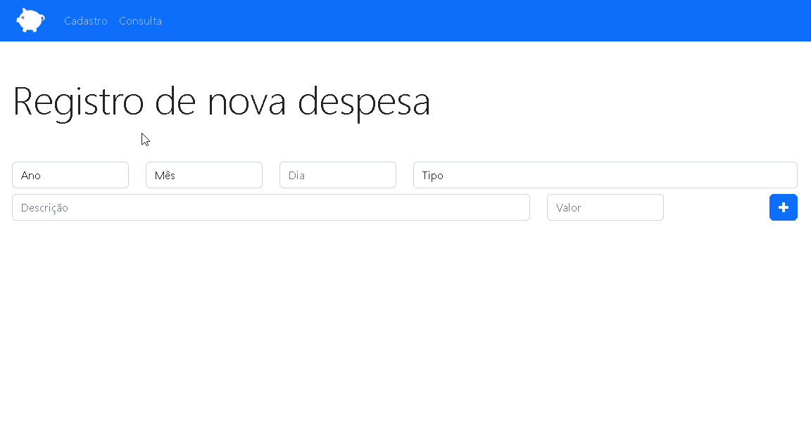

<h1 align="center">
     <a href="#" alt="site de cadastro de usuario"> Orçamento Pessoal </a>
</h1>

<h3 align="center">
    📋 A sua página de cadastro e consulta de Despesas 💙
</h3>

<h4 align="center">
	🚧 Concluído 🚀 🚧
</h4>


<p align="center">
  <a href="#-sobre-o-projeto">Sobre o projeto</a>&nbsp; •
  <a href="#-funcionalidades">Funcionalidades</a>&nbsp; •
  <a href="#-como-executar-o-projeto">Como executar o projeto</a>&nbsp; •
  <a href="#-tecnologias">Tecnologias</a> 
</p>
<br />

>  O projeto chamado Orçamento Pessoal é um sistema de registro de despesas.

Confira a aplicação: https://cadastro-despesas.netlify.app <br>

## 💻 Sobre o projeto

💙 Orçamento Pessoal - Essa aplicação consiste em organizar sua vida financeira a partir de registros de despesas atribuindo dia, valor, tipo da despesa, além de disponibilizar um campo para a descrição da mesma. Podendo filtrar um histórico de gastos em um determinado período de tempo. 

É uma forma de expandir o aprendizado sobre LocalStorage, armazenando dados na própria memória do browser, tendo uma simulação direta e fácil com uma aplicação de cadastro de despesas.

Projeto desenvolvido a partir de um vídeo oferecido pelo professor Jorge Santana do curso da Udemy Desenvolvimento Web Completo 2022.

---

## ⚙️ Funcionalidades

- [x] Layout da aplicação
- [x] Cadastro de Despesas
- [x] Validação dos dados antes de ser registrado
- [x] Listagem das despesas
- [x] Filtragem das despesas
- [x] Removendo despesas


---

## 🚀 Como executar o projeto

### Pré-requisitos

Antes de começar, você vai precisar ter instalado em sua máquina as seguintes ferramentas:
[Git](https://git-scm.com). 
Além disto é bom ter um editor para trabalhar com o código como [VSCode](https://code.visualstudio.com/)


#### 🧭 Rodando a aplicação web (Frontend)

```bash
# Clone este repositório
$ git clone git@github.com:CalebeFelipe/orcamento_pessoal.git
# Acesse a pasta do projeto no seu terminal/cmd
$ cd orcamento_pessoal
# Vá para a pasta da aplicação Front End
$ cd web
# Instale as dependências
$ npm install
# Execute a aplicação em modo de desenvolvimento
$ npm run start
```
---

## 🛠 Tecnologias

As seguintes ferramentas foram usadas na construção do projeto:

#### **Website**  

-   **[HTML](https://developer.mozilla.org/pt-BR/docs/Web/HTML)**
-   **[CSS](https://developer.mozilla.org/pt-BR/docs/Web/CSS)**
-   **[JavaScript](https://developer.mozilla.org/pt-BR/docs/Web/JavaScript)**   
-   **[JQuery](https://jquery.com/)**
-   **[Bootstrap](https://getbootstrap.com/)**

#### **Utilitários**

-   Editor:  **[Visual Studio Code](https://code.visualstudio.com/)**  

---

 <sub><b>Feito com ❤️ por Calebe Felipe 👋🏽 [Entre em contato!](https://www.linkedin.com/in/calebe-felipe-alves-freitas-780b9615a/)</b></sub><br><br>
 
 <br />
 <a href="#top">Volte para o topo</a>


 